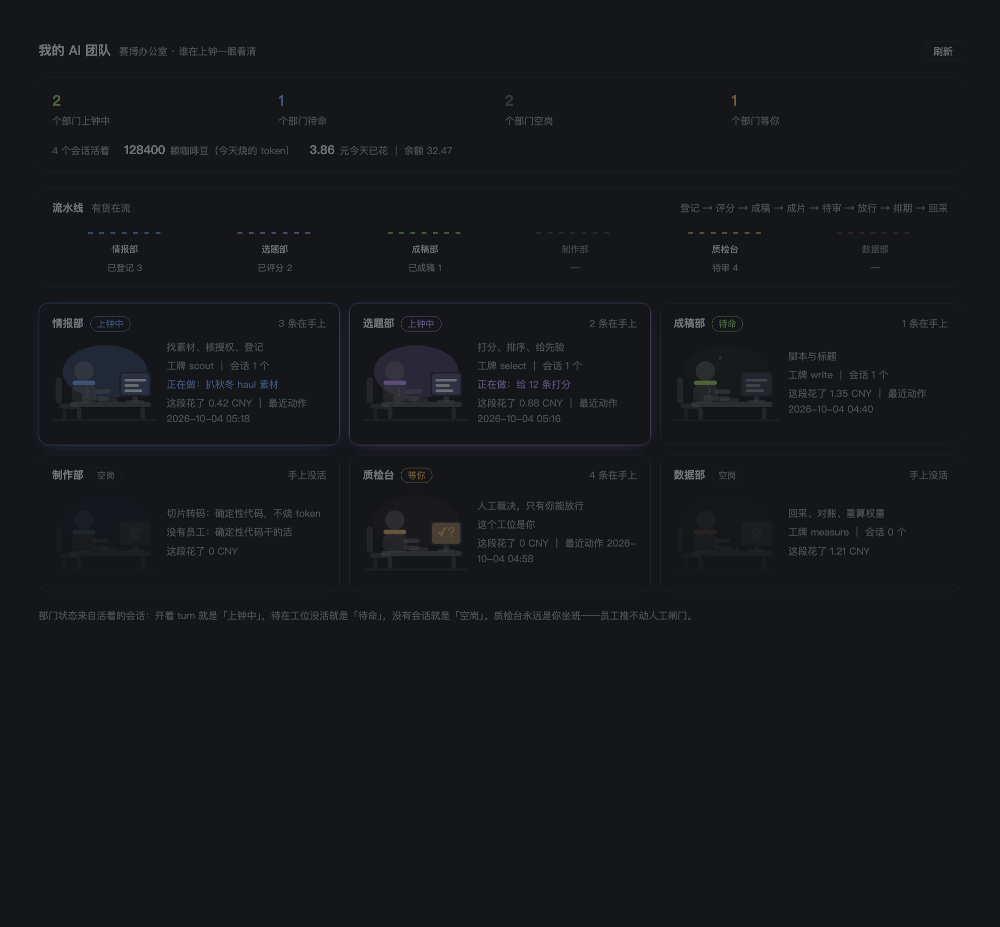
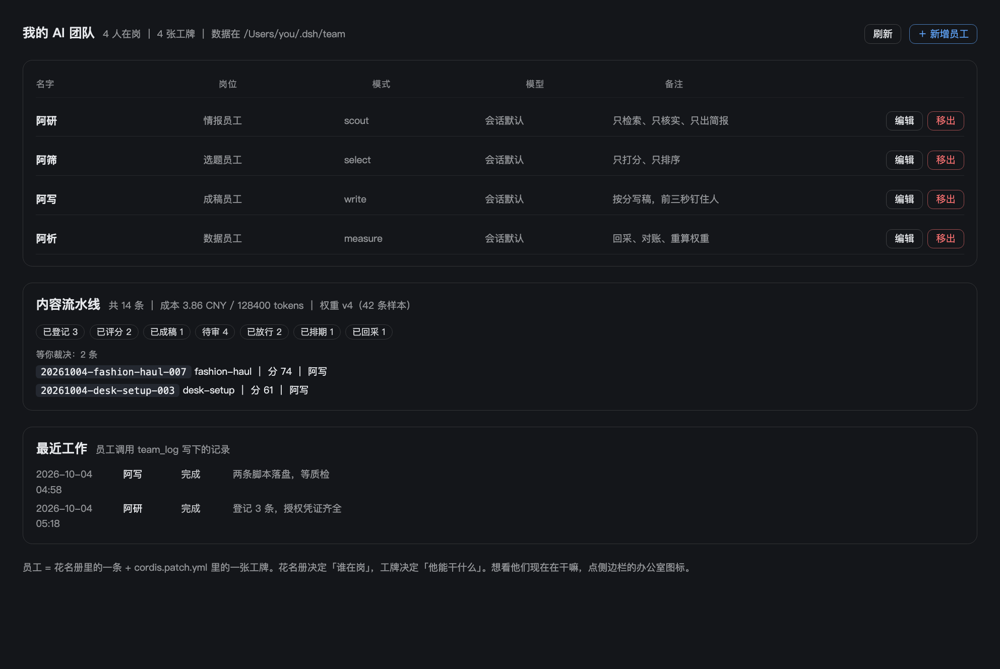
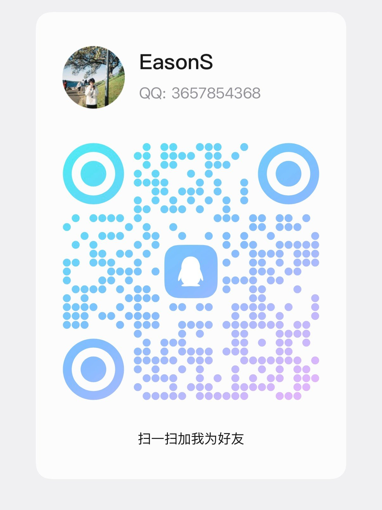

# dsh-team-employees

把 [DeepSeek Harness](https://github.com/deepseek-ai/deepseek-harness) 从「一个助手」变成一个**多员工协同团队**：有工牌、有花名册、有一条内容流水线、有一道只有人能按的闸门，还有一个会动的办公室界面。



- **员工**——五个 agent preset（模式）。给每个员工一张工牌：人设 + 工具集 + 能用哪个模型。情报、选题、成稿、数据四个内容岗，外加一个代码审核岗。
- **花名册**——`$DSH_HOME/team/employees.json`。谁在岗、什么岗位、用哪个模型，写在一个 JSON 里。
- **内容流水线**——素材登记 → 打分 → 写稿 → 渲染 → **人工裁决** → 排期 → 回采 → 重算权重。每个阶段只认特定的前置阶段，谁都不能跳。
- **办公室**——侧边栏一个图标，整页看到六个部门在干嘛：上钟中、待命、空岗、等你。状态来自真实会话，不是装饰动画。
- **员工管理**——「设置 → 员工」里增删改花名册，缺工牌时会给出可复制的配置片段。



## 它为什么不是又一个「AI 助手壳子」

三个设计上的取舍，决定了它跟同类东西不一样：

**闸门是运行时的，不是提示词。** `content_gate`（放行/毙掉）用 `ctx.tools.guard()` 在运行时拦：只要调用来自某个员工会话就直接否决。员工无论被怎么提示、被注入什么，都推不动 `review → queued`。这是三层里的一层，另两层是状态机拒绝从 `review` 出发的转移、`content_publish` 再来磁盘上查一次署名——闸门只需要挡住「员工自我放行」，不挡你手滑。

**能用代码做的，不外包给模型。** 切片、转码、排期全是确定性任务，`content_render` 只登记参数，不调 ffmpeg、更不烧 token。模型只干「判断」和「写」。

**状态诚实。** 「上钟中」的判据是那个员工的会话当前真的开着 turn；账本读不到就说读不到，不编数字；平台收入是美元、账本是人民币，没设汇率就不算净额，两个原值都留着。

## 装上

需要 Node 20+ 和一个能跑的 DeepSeek Harness。

**方式一：本地目录链接（改代码最方便）**

```sh
git clone https://github.com/syc67169-source/dsh-team-employees.git
cd dsh-team-employees
node bin/link-into-profile.mjs --dry-run   # 先看要改什么，不写盘
node bin/link-into-profile.mjs             # 装进 desktop profile
```

脚本只做三件事，都会打印出来：给 `~/.dsh/profiles/<profile>/package.json` 加一条 `link:` 依赖、把插件名追加进 `dsh.profile.bundles`、在 profile 的 `node_modules` 里建软链（原文件先备份成 `package.json.team.bak`）。**完全退出 DSH 再打开**后生效；卸载用 `--remove`。

**方式二：手动改 profile（不想跑脚本）**

在 `~/.dsh/profiles/<profile>/package.json` 里加一条依赖和一条 bundle：

```json
{
  "dependencies": { "dsh-team-employees": "github:syc67169-source/dsh-team-employees" },
  "dsh": { "profile": { "bundles": ["…原有的…", "dsh-team-employees"] } }
}
```

然后在那个 profile 目录里 `pnpm install`。桌面端注意：`dsh plugin --profile desktop` 会被 CLI 拒绝（官方设计如此），手动或走脚本。

## 装上之后

0. 完全退出 DSH 再打开（客户端界面模块在启动时组图）。
1. 侧边栏出现「办公室」图标 → 点进去是六个部门的工位。
2. 「设置 → 员工」能看到花名册，可以增删改。
3. 新建会话 → 模式下拉里出现五位员工。
4. 选「情报员工·阿研」，问她「团队里现在有谁」→ 她调 `team_roster`。再让她登记一条素材 → 回办公室页刷新，情报部那个工位会显示「上钟中」。

## 员工与工具

| 工位 | 模式 id | 干什么 | 工具集 |
|---|---|---|---|
| 情报员工·阿研 | `scout` | 找素材、核授权、登记 | 检索 + 文件 + 内容工具 |
| 选题员工·阿筛 | `select` | 打分、排序、给先验 | 文件 + 内容工具 |
| 成稿员工·阿写 | `write` | 脚本与标题 | 文件 + 内容工具 |
| 数据员工·阿析 | `measure` | 回采、对账、重算权重 | 文件 + shell + 内容工具 |
| 审核员工·阿审 | `reviewer` | 代码审核（与内容线无关） | 文件 + shell |

团队通用工具（`dsh-team-employees/tools`）：`team_roster` 看花名册、`team_log` 写一条工作记录、`team_inbox` 读别人做到哪了。

内容流水线工具（`dsh-team-employees/content`）：`content_new`、`content_score`、`content_script`、`content_render`、`content_queue`、`content_gate`（仅人）、`content_publish`、`metrics_pull`、`weights`、`cost_report`。

设计与字段细节见 [`docs/内容流水线编排设计.md`](docs/内容流水线编排设计.md)。

## 数据在哪

```
$DSH_HOME/team/
├── employees.json          花名册
├── journal.jsonl           团队工作日志（成员之间靠它交接）
├── content/
│   ├── index.jsonl         摘要索引
│   └── <id>/               item.json / events.jsonl / script.md / render.json / publish.json
└── metrics/
    ├── <id>.json           单条回采结果
    └── weights.json        权重表（中位数比值，全表能手算）
```

全部是纯文本，直接看、直接改、直接进版本控制都行。

## 自检

```sh
npm test          # 32 项 + 41 项，都不需要启动 DSH
```

- `test/smoke.mjs`——团队工具的注册契约、Host 的 `/team/api`、办公室状态机（上钟/待命/空岗/人工岗怎么算出来的）、浏览器兜底页、客户端包的槽位注册与界面渲染。
- `test/content.smoke.mjs`——流水线状态机、闸门、记账、权重表。

本机装了 dsh 时，会用 dsh 自己的 schema 校验器验证工具契约（`DSH_TOOLS_ENTRY` 可指定位置）；没装就自动跳过那几条并明确打印说明，其余断言照跑。客户端界面是在一个最小 React 运行时里真渲染过的，所以 CI 不需要浏览器。

看设计不用启动 DSH：

```sh
npm run preview   # 三个界面渲染成静态 HTML 到 docs/preview.html
npm run shot      # 有 Chrome 时顺便重截 docs/images/ 里的图
```

## 目录结构

```
dsh-team-employees/
├── cordis.patch.yml        挂载清单：1 个 Host 行 + 5 个员工 preset
├── employees.json          花名册样例（安装时复制到 $DSH_HOME/team/）
├── lib/
│   ├── index.js            Host：/team 接口 + 办公室数据 + 浏览器兜底页
│   ├── client.js           客户端：侧边栏入口 + 办公室整页 + 设置里的员工管理
│   ├── store.mjs           团队数据读写（花名册 + 日志）
│   ├── tools.js            Agent 工具：team_roster / team_log / team_inbox
│   ├── content.mjs         流水线数据层：状态机 + 队列 + 回采 + 权重
│   ├── content-tools.js    流水线工具 + 人工闸门
│   └── usage.mjs           读本地账本（$DSH_HOME/.dshw-usage.json）
├── bin/link-into-profile.mjs
├── tools/                  预览与截图
└── test/                   两套自检 + 最小 React 运行时
```

## 加一个员工 / 加一个工位

加员工（改花名册，界面里就能做）：`$DSH_HOME/team/employees.json` 加一条。

加工位（要改配置）：`cordis.patch.yml` 里复制一个 `preset-employee-*` 块，改 `id`（小写字母数字连字符）、`name`、`order`、人设和工具集；如果要让他守一段流水线，再在 `lib/index.js` 的 `DEPARTMENTS` 里加一行。设置页在缺工牌时会给出可以复制的片段，但不会替你改配置文件。

想给某个员工指定别的厂商模型：先在「设置 → 模型」里配上（运行时内置 openai / anthropic / google / xai 等多条路由，填 key 即生效），再把花名册里那条的 `model` 填成 `provider/model`。

## 边界与风险

- **闸门只挡员工，不挡你。** 它防的是「员工自我放行」，不是防你手滑。
- **`exec.agent` 是宿主内部字段。** 这是目前唯一能区分「人 vs 员工」的手段，闸门押在它上面。升级 DSH 后请重跑自检确认它还在拦。
- **账本是 best-effort。** `.dshw-usage.json` 由宿主写，不是公开契约；读不到就退回「读不到」，不编数字。
- **不代发、不批量多账号、不绕平台风控。** 发布这一步刻意留给人：`content_publish` 只写本地发布包，不接触任何平台接口。
- **`bin/render.mjs` 还没写。** `content_render` 只登记参数；真正的 ffmpeg 转码是下一步。
- **版本跟着 DSH 走。** 针对 `0.2.0-rc.2` 的运行时写的，宿主接口变动时需要跟着改；自检会告诉你哪一条不对了。

## 许可

MIT，见 [LICENSE](LICENSE)。

## 联系与交流

用这个插件遇到问题、想提需求，或者只是想让别人知道你在拿它干什么——扫码加我：



QQ：`3657854368`（EasonS）
